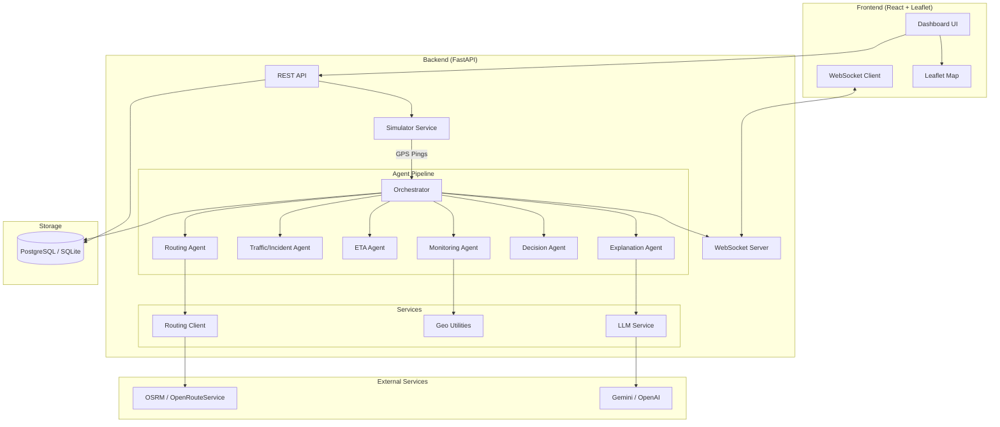
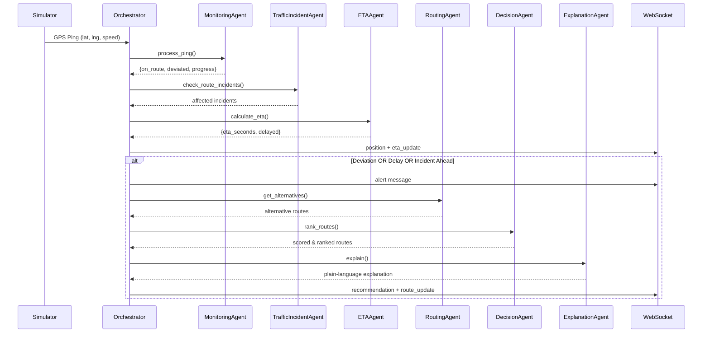

# GeoAgentic Framework for Emergency Vehicle Movement

A geospatial, agent-based decision-support system for control-room operators that tracks simulated emergency vehicles, detects route deviations/delays/incidents, updates ETAs, recommends suitable alternative routes, and explains recommendations using an LLM — all on an interactive map dashboard.

> **Note**: This is a prototype/demo system using simulated GPS, traffic, and incident data. Route recommendations are described as "suitable" or "optimized" — never "safest".

## Architecture



## Agent Pipeline



## Tech Stack

| Layer | Technology |
|-------|-----------|
| **Backend** | Python 3.11, FastAPI, WebSockets, SQLAlchemy (async) |
| **Database** | PostgreSQL (Supabase-compatible); SQLite fallback for local dev |
| **Routing** | OSRM public demo API or OpenRouteService (configurable) |
| **Geospatial** | Shapely for geometry operations |
| **LLM** | Gemini or OpenAI (env-configurable), with template fallback |
| **Frontend** | React (Vite), Leaflet (react-leaflet), Tailwind CSS |
| **Container** | Docker Compose (backend + PostgreSQL) |

## Project Structure

```
├── backend/
│   ├── app/
│   │   ├── main.py              # FastAPI app entry point
│   │   ├── config.py            # Settings (pydantic-settings)
│   │   ├── db.py                # Async SQLAlchemy setup
│   │   ├── models.py            # ORM models
│   │   ├── schemas.py           # Pydantic schemas
│   │   ├── agents/
│   │   │   ├── orchestrator.py  # Event-driven pipeline coordinator
│   │   │   ├── monitoring.py    # Route deviation detection
│   │   │   ├── traffic_incident.py  # Incident & congestion tracking
│   │   │   ├── eta.py           # ETA calculation with congestion
│   │   │   ├── routing.py       # Alternative route fetching
│   │   │   ├── decision.py      # Deterministic route scoring
│   │   │   └── explanation.py   # LLM-powered explanations
│   │   ├── services/
│   │   │   ├── routing_client.py  # OSRM/ORS client with caching
│   │   │   ├── geo.py            # Geospatial utilities (Shapely)
│   │   │   ├── llm.py            # LLM provider abstraction
│   │   │   └── simulator.py      # GPS simulation engine
│   │   └── api/
│   │       ├── trips.py         # Trip CRUD endpoints
│   │       ├── incidents.py     # Incident management
│   │       ├── simulate.py      # Simulation control
│   │       └── stream.py        # WebSocket streaming
│   ├── tests/
│   │   ├── test_monitoring.py   # Deviation detection tests
│   │   ├── test_eta.py          # ETA calculation tests
│   │   ├── test_decision.py     # Route scoring tests
│   │   └── test_geo.py          # Geo utility tests
│   ├── Dockerfile
│   ├── requirements.txt
│   └── .env.example
├── frontend/
│   ├── src/
│   │   ├── App.jsx
│   │   ├── components/
│   │   │   ├── MapView.jsx      # Leaflet map with routes & markers
│   │   │   ├── SidePanel.jsx    # ETA, recommendations, alerts
│   │   │   ├── ControlBar.jsx   # Simulation & incident controls
│   │   │   ├── AlertFeed.jsx    # Real-time alert stream
│   │   │   └── StatusBar.jsx    # Connection status header
│   │   └── hooks/
│   │       ├── useWebSocket.js  # Auto-reconnecting WS hook
│   │       └── useApi.js        # REST API hook
│   ├── package.json
│   └── vite.config.js
├── docker-compose.yml
└── README.md
```

## Quick Start

### Prerequisites

- Python 3.11+
- Node.js 18+
- (Optional) Docker & Docker Compose

### 1. Backend Setup

```bash
cd backend

# Create virtual environment
python -m venv venv
source venv/bin/activate  # Linux/Mac
# or: venv\Scripts\activate  # Windows

# Install dependencies
pip install -r requirements.txt

# Configure environment
cp .env.example .env
# Edit .env with your API keys (optional for LLM features)

# Run the backend
uvicorn app.main:app --reload --port 8000
```

### 2. Frontend Setup

```bash
cd frontend

# Install dependencies
npm install

# Start development server
npm run dev
```

The dashboard will be available at `http://localhost:5173`.

### 3. Docker Setup (Alternative)

```bash
# Start PostgreSQL + Backend
docker-compose up -d

# Then start the frontend separately
cd frontend && npm install && npm run dev
```

## Demo Script

### Automated Demo Scenario

1. **Open the dashboard** at `http://localhost:5173`
2. Click **"Demo Scenario"** — this creates a trip from Majestic to Koramangala (Bangalore) and runs a scripted simulation:
   - **Phase 1** (0-30%): Normal driving along the planned route
   - **Phase 2** (~30%): An accident is injected ahead on the route
   - **Phase 3**: System detects the incident, calculates alternatives, ranks them, and generates an AI explanation
   - **Phase 4**: Vehicle continues to destination
3. Watch the **side panel** for real-time ETA updates, alerts, and AI route recommendations
4. Click alternative routes on the map for details

### Manual Interaction

1. Click **"New Trip"** to create a trip with default Bangalore coordinates
2. Click **"Start Sim"** to begin the simulation
3. Click **"Add Incident"** then click on the map ahead of the vehicle to place a roadblock
4. Observe the system detect the incident and suggest alternative routes
5. Use the **incident type** and **severity** dropdowns to configure incidents

## API Reference

| Method | Endpoint | Description |
|--------|----------|-------------|
| `POST` | `/trips` | Create a new trip (fetches route from OSRM) |
| `GET` | `/trips/{id}` | Get trip details with positions & recommendations |
| `POST` | `/incidents` | Report an incident (broadcasts to all streams) |
| `GET` | `/incidents` | List active incidents |
| `DELETE` | `/incidents/{id}` | Deactivate an incident |
| `POST` | `/simulate/start` | Start GPS simulation for a trip |
| `POST` | `/simulate/stop` | Stop simulation |
| `POST` | `/simulate/scenario` | Run the scripted demo scenario |
| `WS` | `/stream/{trip_id}` | WebSocket stream for real-time updates |

### WebSocket Message Types

| Type | Description |
|------|-------------|
| `position` | Vehicle GPS position update |
| `eta_update` | Updated ETA with delay information |
| `alert` | System alert (deviation, delay, incident) |
| `recommendation` | AI route recommendation with explanation |
| `route_update` | Alternative route geometries for map display |

## Configuration

All configuration is via environment variables (see `.env.example`):

| Variable | Default | Description |
|----------|---------|-------------|
| `DATABASE_URL` | `sqlite+aiosqlite:///./geoagentic.db` | Database connection string |
| `ROUTING_PROVIDER` | `osrm` | Routing engine (`osrm` or `ors`) |
| `OSRM_BASE_URL` | `https://router.project-osrm.org` | OSRM API base URL |
| `ORS_BASE_URL` | `https://api.openrouteservice.org` | OpenRouteService base URL |
| `ORS_API_KEY` | _(empty)_ | ORS API key (required if using ORS) |
| `LLM_PROVIDER` | `none` | LLM provider (`gemini`, `openai`, or `none`) |
| `GEMINI_API_KEY` | _(empty)_ | Google Gemini API key |
| `OPENAI_API_KEY` | _(empty)_ | OpenAI API key |
| `CORS_ORIGINS` | `http://localhost:5173` | Allowed CORS origins |
| `SIMULATOR_TICK_INTERVAL` | `1.0` | Seconds between simulated GPS pings |

## Running Tests

```bash
cd backend
pytest -v
```

## Agent Details

### Scoring Weights (DecisionAgent)

| Factor | Weight | Description |
|--------|--------|-------------|
| ETA | 0.4 | Estimated time of arrival (lower is better) |
| Distance | 0.3 | Total route distance (lower is better) |
| Congestion Exposure | 0.2 | Proportion of route segments affected by incidents |
| Incident Proximity | 0.1 | Minimum distance from route to any incident |

### Deviation Detection (MonitoringAgent)

- **Threshold**: 50 meters off-route
- **Trigger**: 3 consecutive pings off-route
- **Recovery**: Automatically clears when vehicle returns to route

### Delay Detection (ETAAgent)

- **Threshold**: >20% above baseline ETA
- **Factors**: Remaining distance, segment speeds, congestion factors

## Limitations

1. **Simulated Data Only**: All GPS positions, traffic, and incidents are simulated. No real-world data integration.
2. **OSRM Public Demo Server**: The default OSRM endpoint is a public demo server with rate limits and no SLA. For production, deploy a local OSRM instance.
3. **Simplified Geospatial Calculations**: Uses degree-to-meter approximation rather than proper geodesic projections. Accuracy decreases at higher latitudes.
4. **Single Vehicle Focus**: The prototype tracks one vehicle at a time. Multi-vehicle coordination is not implemented.
5. **No Authentication**: No user authentication or authorization. Not suitable for production deployment without adding security.
6. **LLM Dependency**: Route explanations require a configured LLM API key. Falls back to templates when unavailable.
7. **In-Memory Route Cache**: Route cache is not persisted across restarts. For production, use Redis or similar.
8. **No Real-Time Traffic**: Congestion factors are manually set or simulated. No integration with real traffic data providers.
9. **SQLite Limitations**: SQLite is used for local development but doesn't support concurrent writes well. Use PostgreSQL for any multi-user scenario.
10. **Bangalore-Centric Defaults**: Default coordinates and routes are set to Bangalore, India. Works with any location supported by OSRM.

## License

This project is a prototype built for demonstration purposes.
